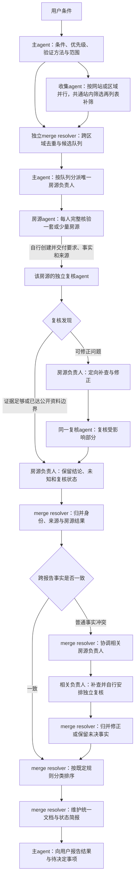
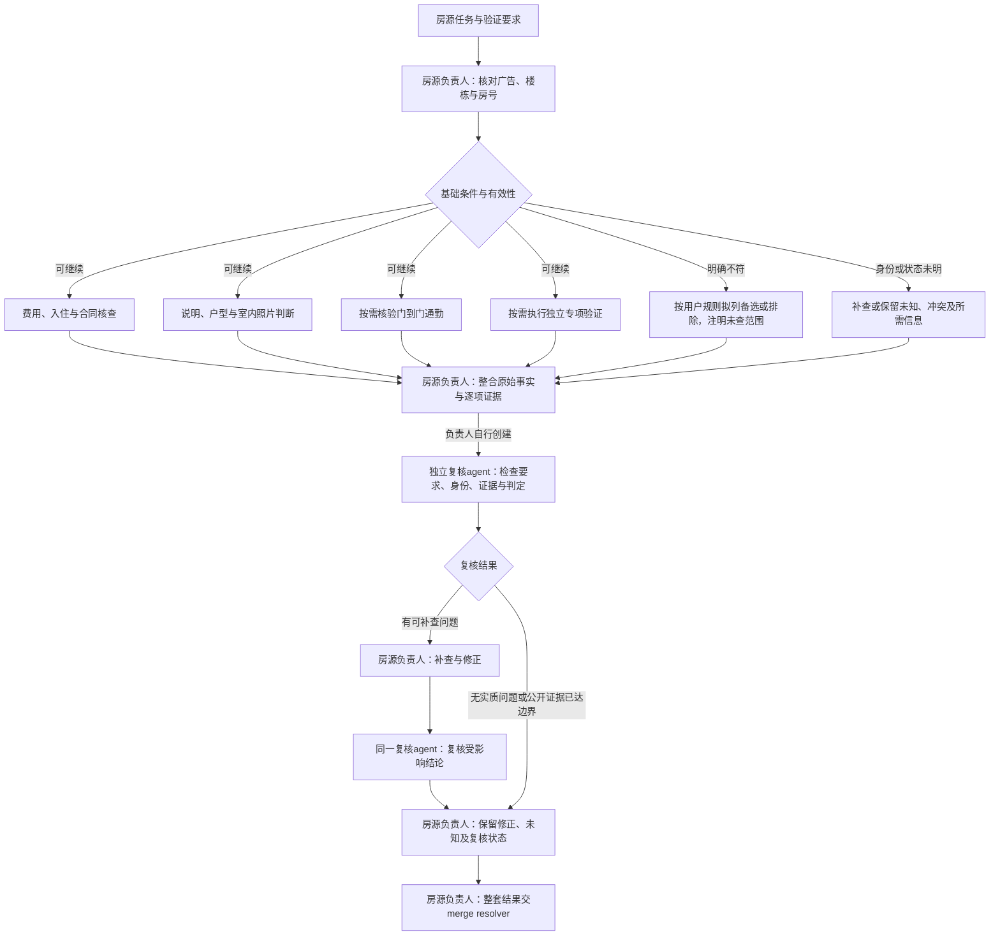

# 工作流程 DAG

## 主agent、merge resolver与房源负责人

网站／区域收集任务之间可并行；完成共通初筛的一批先去重，再启动对应房源的并行完整核验，不必等待所有收集任务。收集和已就绪房源核验可流水并行，收集按批次交接。merge resolver独立维护身份、来源、结果与文档；主agent负责资源和方向。复核agent由对应房源agent创建并向其回传，不由主agent创建来逐套审查。

条件含义、阈值、验证方法、优先级、范围或授权变化才升级主agent；普通事实差异由merge resolver协调房源负责人处理。主agent可依据各角色简报随时向用户报告进度，不需等到图中最终交付。

## 单套房源内部

费用、详情、通勤、专项检查没有依赖时可并行，但房源负责人始终负责整套结果。专项分支不等于独立复核。明确未知可以结束本轮复核，未知硬条件不能因此通过；可补查问题未解决或来源受阻时照实标明。用户要求继续检查备选或已排除房源的其他条件时，按授权范围执行。

两图将补查和再次复核展开为前向节点，保持无环。仍需后续补查时继续展开新的修正节点：单套问题由房源负责人跟进，跨房源事实问题由merge resolver协调；只有范围或规则变化需要主agent重新编排。没有独立agent能力时按相同职责自查并明确标“未独立复核”，不把顺序自查冒充图中的独立角色。
