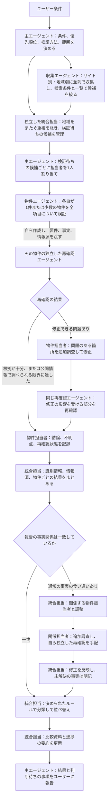
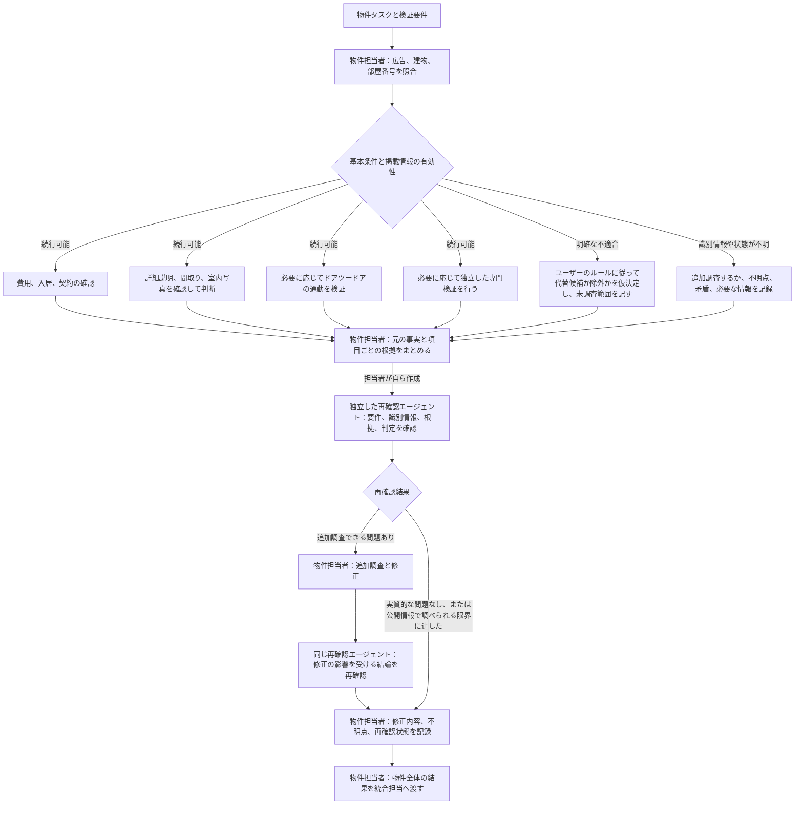

# ワークフローDAG

## 主エージェント、統合担当、物件担当者の分担

サイト別・地域別の収集は並列で進められる。共通条件の一次選別が済んだ候補から、まとまった単位で統合担当（merge resolver）に渡す。重複を除いた物件は全項目の検証を並列で始められるため、すべての収集タスクの終了を待つ必要はない。収集を続けながら、準備ができた物件の検証も進める。

統合担当は識別情報、情報源、調査結果、比較資料を独立して管理する。主エージェントは作業の割り振りと進め方を担当する。再確認エージェントは物件エージェントが自ら作成し、その物件エージェントに結果を返す。主エージェントが作成して物件ごとに審査する形にはしない。

条件の意味、基準値、検証方法、優先順位、範囲、承認を変える場合だけ、主エージェントに判断を求める。通常の事実の食い違いは、統合担当が物件担当者と調整する。主エージェントは各役割の報告を基に、いつでもユーザーへ進捗を伝えられる。図の最後の提出まで待つ必要はない。

## 1件の物件を調べる手順

費用、詳細、通勤、専門的な確認は、互いの結果を待つ必要がなければ並列で進められる。ただし、物件全体の結果には常に物件担当者が責任を持つ。専門的な確認を分担しても、独立した再確認を行ったことにはならない。

不明点を明記したうえで今回の再確認を終えてよい。ただし、不明な必須条件を合格にしてはならない。追加調査できる問題が未解決の場合や、情報源にアクセスできない場合も、そのまま記す。代替候補や除外済みの物件について他の条件も調べるようユーザーが求めた場合は、承認された範囲で確認を続ける。

両図は、追加調査と再確認を後続のノードとして描き、循環しない構造にしている。さらに調査が必要なら、新しい修正ノードを後ろに追加する。1件の物件内の問題は物件担当者が追跡し、物件間の事実の食い違いは統合担当が調整する。範囲やルールを変える場合だけ、主エージェントが作業を組み直す。

独立したエージェントを使えない場合は、同じ責任分担に沿って自己点検し、「独立した再確認は未実施」と明記する。順番に自己点検しただけなのに、図のように独立した役割が確認したと装ってはならない。
