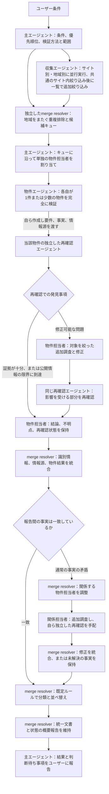
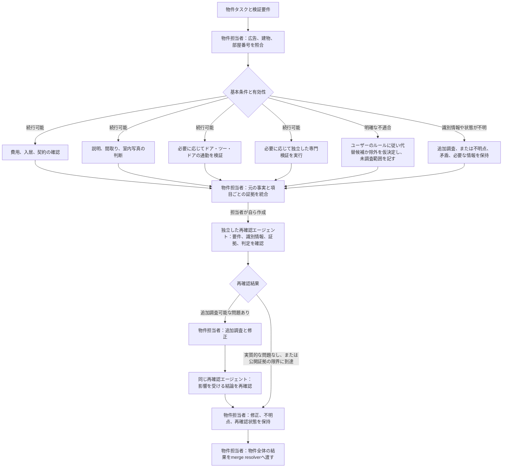

# ワークフロー DAG

## 主エージェント、merge resolverと物件担当者

サイト別／地域別の収集タスクは並行実行できる。共通の初期絞り込みが完了した一群から先に重複を排除し、該当物件の完全な検証を並行して開始する。すべての収集タスクを待つ必要はない。収集と準備済み物件の検証はパイプラインとして並行実行でき、収集結果はバッチごとに引き継ぐ。merge resolverは識別情報、情報源、結果、文書を独立して維持し、主エージェントはリソースと方向性を担当する。再確認エージェントは該当する物件エージェントが作成し、その物件エージェントに結果を返す。主エージェントが作成して物件ごとに審査する形にはしない。

条件の意味、基準値、検証方法、優先順位、範囲、承認に変更がある場合のみ、主エージェントに判断を求める。通常の事実の相違はmerge resolverが物件担当者を調整して対応する。主エージェントは各役割の概要報告を基にいつでもユーザーへ進捗を報告でき、図の最終納品まで待つ必要はない。

## 1件の物件内

費用、詳細、通勤、専門確認は依存関係がなければ並行実行できるが、物件担当者は常に物件全体の結果に責任を持つ。専門分岐は独立した再確認と同じではない。不明点を明示すれば今回の再確認を終えてよいが、それによって不明な必須条件を合格にすることはできない。追加調査可能な問題が未解決の場合や情報源にアクセスできない場合は、そのまま明記する。代替候補や除外済み物件の他の条件を引き続き確認するようユーザーが求めた場合は、承認された範囲内で実行する。

両図では追加調査と再確認を前向きのノードに展開し、循環しない構造を維持している。さらに追加調査が必要な場合は、新たな修正ノードを展開する。単独物件の問題は物件担当者が追跡し、物件間の事実の問題はmerge resolverが調整する。範囲やルールが変わる場合のみ、主エージェントによる再編成が必要になる。独立したエージェントを使えない場合は、同じ責任分担で自己点検し、「独立した再確認は未実施」と明示する。順番に行う自己点検を、図の独立した役割のように装わない。
